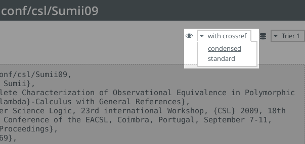

# 参考文献の書き方

LaTeX において、参考文献を書くときは、BibTeX を使うようにしましょう。
論文テンプレートでは、デフォルトで BibTeX を使うようになっています。
BibTeX を使うと、論文中で参照されている参考文献を、
`refs.bib` の中から自動的に選択して、論文に埋め込んでくれます。
また、参考文献の書式も整えてくれるので、便利です。
（`thebibliography` 環境を使って、自力で書式を整える方法もありますが、
発表時にミスを指摘されることが多いです。BibTeX を使うのが無難です。）

参考文献は `refs.bib` に追加しましょう。
「文献の著者(or 題名) + bibtex」でググると、大抵は BibTeX の書き方が出てくるので、
それを流用するといいでしょう。

## DBLP を使う

「論文題目 + bibtex + dblp」や「著者名 + bibtex + dblp」でググると、
文献の BibTeX データを入手できます。DBLP は計算機科学系の参考文献データベースで、
大量の論文が登録されているので、それなりの確率で目的の BibTeX データが手に入ります。
論文タイトルの隣の **export record** から BibTeX コードを入手できます。

例：http://dblp.uni-trier.de/pers/hd/s/Sumii:Eijiro （sumii bibtex でヒットした住井先生の論文リスト）

DBLP の BibTeX データは比較的信頼できますが、ときどき間違っているので、
書き換えのポイントを説明しておきます。

### 1. 固有名詞の頭を大文字にする

固有名詞の中で大文字になるべき文字が小文字になっていることが多いです
（例えば、OCaml が ocaml になっていたり、GADT が gadt になっていたりなど）。
BibTeX は文献題目などの先頭以外の文字を勝手に小文字に変換するので、
大文字にしたいところを明示的に `{...}` で囲む必要があることに、注意して下さい。
例えば、

    @article{...,
      author = {John Smith},
      title  = {Functional programming in OCaml},
      ...}

と書いてあった場合、参考文献のタイトルが "Functional programming in ocaml" になってしまうので、

    @article{...,
      author = {John Smith},
      title  = {Functional programming in {OC}aml},
      ...}

と書き直します。
ちなみに、大文字になる文字・文字列のみをピンポイントで囲むのが美しいやり方とされています。

### 2. 参照の削除

DBLP はあくまでデータベースなので、論文自体と論文が掲載された書籍や雑誌の情報を、
別々に掲載していることがあります。

例：http://dblp.uni-trier.de/rec/bibtex2/conf/csl/Sumii09

この場合、そのまま `refs.bib` に書くと、参考文献として無駄に 2 つのエントリができてしまい、見苦しいので、
うまく情報をマージする必要があります。
手作業でマージしても良いですが、DBLP には crossref なしの BibTeX コードを出力する機能があるので、
それを使ったほうが簡単です。
DBLP の BibTeX コードがあるページの右上に **with crossref** というプルダウンメニューがあるので、
そこから **standard**（もしくは **condensed**）を選びます。

すると、crossref なしの BibTeX コードが出力されます。
condensed だと、standard よりも情報が少ないシンプルなコードが出力されます。
投稿論文などでスペースが少なく、可能な限り参考文献の文字数を削りたいときは、
condensed でも良いですが、普段は（卒論などでは）standard で良いでしょう。

## URL を参考文献に載せる

論文になっていないライブラリを参考文献にしたいときなどは、
自力で URL を参考文献に追加する必要があります。
このときは、

    @misc{ID,
      author={著者の名前},
      title={タイトル},
      howpublished={\url{http://...}},
      year={20XX}}

のようなエントリを、`resf.bib` に追加します。
`ID` は `paper.tex` から参照するときの名前（識別子）で、参照するときは `\cite{ID}` のようにします。
例えば、

    @misc{lib:JaneStreetCore,
      author={Jane Street},
      title={{J}ane {S}treet {C}ore},
      howpublished={\url{http://janestreet.github.io/}},
      year={2014}}

であれば、`\cite{lib:JaneStreeCore}` で参照できます
（`{...}` で囲むと大文字になります）。
