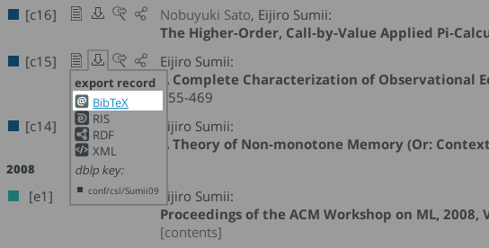

# 参考文献の書き方（スライド）

論文や記事などでは

Luís Damas, Robin Milner.
Principal Type-Schemes for Functional Programs. POPL 1982. 207-212.
[DBLP](http://dblp.uni-trier.de/rec/bibtex/conf/popl/DamasM82)

のように論文のタイトルやページ番号などを詳細に書きますが、
スライドでは情報が多すぎてわかり難いので、基本的には

- 著者名：通常は苗字 (family name) のみ。複数人いる場合の省略については後述。
- 学会または論文誌の略称：省略することもある
- 発表年：論文を発表した年（西暦）

の情報を括弧の中に書きます。例えば、

- `[Damas & Milner, POPL1982]`
- `[Damas & Milner, POPL'82]`
- `[Damas & Milner (POPL1982)]`
- `(Damas & Milner, POPL1982)`

などのように書きます。
どのスタイルを使うかは好みの問題ですが、スライド中では統一すべきです。
また、著者と学会名の区切りとしてカンマではなく空白だけ使う人もいます。
ちなみに、
POPL (ACM SIGPLAN-SIGACT Symposium on **P**rinciples **o**f **P**rogramming **L**anguages)
はプログラミング言語理論の分野のトップ学会の 1 つです。
`[Damas & Milner, POPL1982]` は Damas と Milner が POPL1982 で発表した研究を指し、
大抵の場合は著者名と学会と開催年がわかればググって見つけることができます。

口頭で参考文献の著者について触れるときは、
苗字だけ呼び捨て（〜さんや先生、教授、Dr. などの敬称は付けない）です。

## 注意事項

### 学会名の省略

学会名は省略して `[Damas & Milner, 1982]` などとすることもあります。
できれば書いたほうが良いですが、スライドはスペースが限られているので、
省略することもあります。

### 著者の省略

スライドのスペースに余裕がある場合は全ての著者を明記するべきですが、
どうしても余裕がない場合は省略します（それでも、できれば著者が 3 人以上の場合に留めるべき）。
例えば、

- `[Sato, Murakami+ ICFP2010]`
- `[井上, 佐伯他, JSSST2010]`

などのように略します。
第一著者 (first author) や第二著者 (second author) は論文に大きな貢献をした人であることが多いので、
大抵は省略時は第一・第二著者の名前を書きます。
ただし、以下のような場合では第一著者を省略することがあります。

- 学生と指導教員の共著：この場合は学生が第一、教員が第二著者になることが多いが、
  省略時は教員の名前を使うことが一般的。例えば、`[Damas & Milner, POPL1982]`
  は Damas が Milner の学生だった頃に書いた論文なので、`[Damas+ POPL1982]` ではなく、
  `[Milner+ POPL1982]` と書く。
- 著者をアルファベット順でソートしている場合：そもそも論文への貢献度順に並んでいない

このような場合は、誰を省略すべきかわかり難いので、
全員書くか先生に相談するのが無難です。

### Post-proceedings や technical report について

この注意事項はスライドだけでなく、論文にも共通します。

学会の発表前に 1〜2 ページ程度の要旨を提出し、
発表後にもっと長い論文 (post-proceedings) を書いて投稿することがあります。
例えば、ICFP (The International Conference on Functional Programming)
に併設されている ML/OCaml Workshop では口頭発表の後に、
特に有意義な研究の論文を [EPTCS](http://www.eptcs.org/) (Electronic
Proceedings in Theoretical Computer Science) に掲載しています。
大抵の場合、学会発表のタイトルと post-proceedings のタイトルは同じなので、
自分がどっちを参照しているのか注意が必要です。
普通は post-proceedings の方が詳細な内容なので、そちらを参照すべきです。

また同様に、技術報告書 (technical report) についても発表後に
詳細な内容の論文が論文誌に投稿されていることがあるので、
後者を読んで参照すると良いでしょう。

# 参考文献の書き方（論文）

LaTeX において、参考文献を書くときは、BibTeX を使うようにしましょう。
論文テンプレートでは、デフォルトで BibTeX を使うようになっています。
BibTeX を使うと、論文中で参照されている参考文献を、
`refs.bib` の中から自動的に選択して、論文に埋め込んでくれます。
また、参考文献の書式も整えてくれるので、便利です。
（`thebibliography` 環境を使って、自力で書式を整える方法もありますが、
発表時にミスを指摘されることが多いです。BibTeX を使うのが無難です。）

参考文献は `refs.bib` に追加しましょう。
「文献の著者(or 題名) + bibtex」でググると、大抵は BibTeX の書き方が出てくるので、
それを流用するといいでしょう。

## DBLP を使う

「論文題目 + bibtex + dblp」や「著者名 + bibtex + dblp」でググると、
文献の BibTeX データを入手できます。DBLP は計算機科学系の参考文献データベースで、
大量の論文が登録されているので、それなりの確率で目的の BibTeX データが手に入ります。
論文タイトルの隣の **export record** から BibTeX コードを入手できます。

例：http://dblp.uni-trier.de/pers/hd/s/Sumii:Eijiro （sumii bibtex でヒットした住井先生の論文リスト）

DBLP の BibTeX データは比較的信頼できますが、ときどき間違っているので、
書き換えのポイントを説明しておきます。

### 1. 固有名詞の頭を大文字にする

固有名詞の中で大文字になるべき文字が小文字になっていることが多いです
（例えば、OCaml が ocaml になっていたり、GADT が gadt になっていたりなど）。
BibTeX は文献題目などの先頭以外の文字を勝手に小文字に変換するので、
大文字にしたいところを明示的に `{...}` で囲む必要があることに、注意して下さい。
例えば、

    @article{...,
      author = {John Smith},
      title  = {Functional programming in OCaml},
      ...}

と書いてあった場合、参考文献のタイトルが "Functional programming in ocaml" になってしまうので、

    @article{...,
      author = {John Smith},
      title  = {Functional programming in {OC}aml},
      ...}

と書き直します。
ちなみに、大文字になる文字・文字列のみをピンポイントで囲むのが美しいやり方とされています。

### 2. 参照の削除

DBLP はあくまでデータベースなので、論文自体と論文が掲載された書籍や雑誌の情報を、
別々に掲載していることがあります。

例：http://dblp.uni-trier.de/rec/bibtex2/conf/csl/Sumii09

この場合、そのまま `refs.bib` に書くと、参考文献として無駄に 2 つのエントリができてしまい、見苦しいので、
うまく情報をマージする必要があります。
手作業でマージしても良いですが、DBLP には crossref なしの BibTeX コードを出力する機能があるので、
それを使ったほうが簡単です。
DBLP の BibTeX コードがあるページの右上に **with crossref** というプルダウンメニューがあるので、
そこから **standard**（もしくは **condensed**）を選びます。

すると、crossref なしの BibTeX コードが出力されます。
condensed だと、standard よりも情報が少ないシンプルなコードが出力されます。
投稿論文などでスペースが少なく、可能な限り参考文献の文字数を削りたいときは、
condensed でも良いですが、普段は（卒論などでは）standard で良いでしょう。

## URL を参考文献に載せる

論文になっていないライブラリを参考文献にしたいときなどは、
自力で URL を参考文献に追加する必要があります。
このときは、

    @misc{ID,
      author={著者の名前},
      title={タイトル},
      howpublished={\url{http://...}},
      year={20XX}}

のようなエントリを、`resf.bib` に追加します。
`ID` は `paper.tex` から参照するときの名前（識別子）で、参照するときは `\cite{ID}` のようにします。
例えば、

    @misc{lib:JaneStreetCore,
      author={Jane Street},
      title={{J}ane {S}treet {C}ore},
      howpublished={\url{http://janestreet.github.io/}},
      year={2014}}

であれば、`\cite{lib:JaneStreeCore}` で参照できます
（`{...}` で囲むと大文字になります）。
